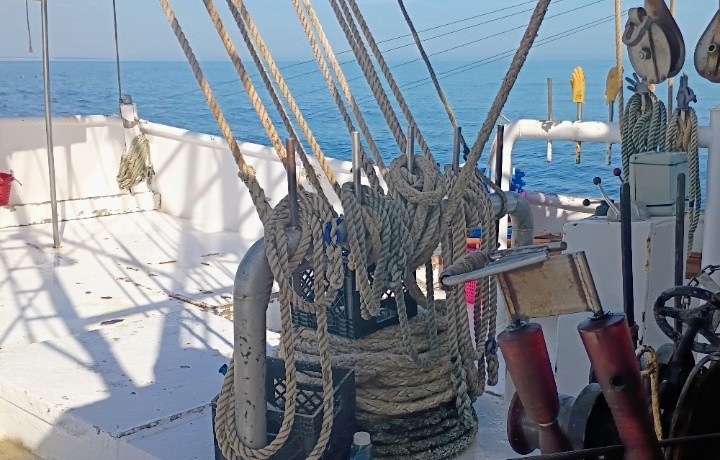
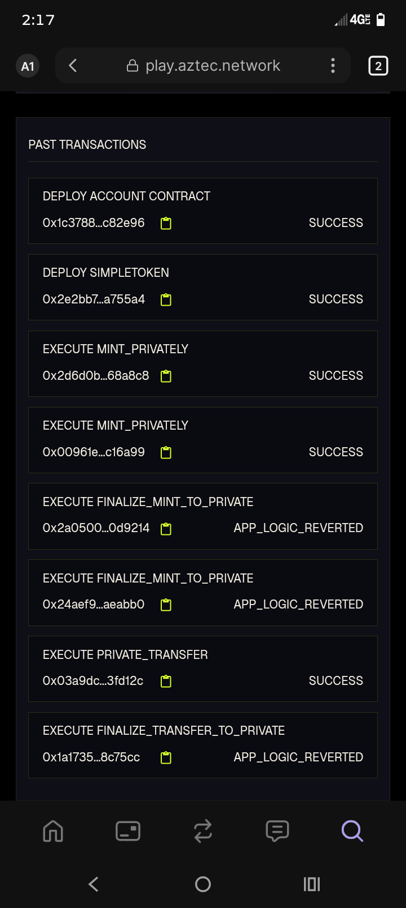

✅ $SHRP Scarcity: 25k Hard Cap.
✅ Syndicate Rev: 5% Legacy Fee Automated.
✅ Family First: 2033 & 2035 ZK-Time-Locks.
✅ Elite Access: 50 Ironclad Badges only.
The Mission Statement: "Building a 10-year private bridge for W'yatt (2033) and Julianna (2035) using Aztec ZK-Rollups".
The Security Architecture: Mention that the keys are backed up in a Proton Secure Node (srv-node-8821@proton.me) and verified with a Recovery Kit.
The Logic Rules: Define the 50-Badge Hard Cap and the 5% Generation Fee so the community knows the rules of the sea.

  

🚢 StationaryDev37: Aztec 30-Day Challenge
Day 1: Maiden Voyage
Goal: Bridge from commercial shrimping to ZK development.
Achievement: Created professional GitHub repo & executed first private transfer on Aztec Playground.
Proof: 5 $AZTEC-test sent to vault.
---
### 🛠️ Day 2: Advanced Private Execution Success
**Technical Achievement:** Successfully navigated the Aztec Playground to perform core privacy functions.
* **Confidential Minting:** Executed `MINT_PRIVATELY` twice with a "SUCCESS" status.
* **Private Transfer:** Successfully moved assets via `PRIVATE_TRANSFER` on-chain.
* **Infrastructure:** Successfully deployed both the **Account Contract** and the **SimpleToken** contract.
**Visual Evidence of Chain Success:**

"Log 02 // Jan 12, 2026: The Compass is Cast. We have finalized the Note Discovery logic in Noir. Even in a sea of millions of private transactions, the kids now have the mathematical map to find their legacy. The Bridge-to-Freedom is now searchable only by the bloodline."
📜 Captain’s Log: Entry 03 // Jan 12, 2026
"Log 03: The Frequency is Set. We have deployed the Discovery.nr logic. This is the 'Lion-Hearted' circuit that allows W'yatt and Julianna to tune into their specific legacy frequency in the year 2033 and 2035. We are no longer just building a vault; we are building the compass that finds it in the dark."
Circuit Logic Engine Primary Purpose Security Layer
Main.nr Founders Gate Manages the $SHRP supply (25k cap) and the 5% Syndicate Fee. Private State / Admin Public Key
Badge.nr Proof of Honor Limits the "Founding 50" Badges. Ensures exclusivity for the original crew. Nullifier-based Minting
Discovery.nr The Compass Allows W'yatt (2033) and Julianna (2035) to find their private notes in the tree.
Circuit Logic Engine The "WE" Purpose Security Protocol
Main.nr The Foundry Manages the $SHRP supply and the 5% Syndicate fee for the family mission. Private State: Balances are encrypted in the Data Tree.
Badge.nr The Honor Guard Enforces the "Founding 50" limit. Proves who was there at the start. Nullifier Sets: Prevents double-claiming of the legacy.
Discovery.nr The Compass The "Lion-Hearted" logic that lets W'yatt (2033) and Julianna (2035) find their notes. Merkle Membership: Scans the tree without revealing the leaf.
📜 Captain’s Log: Entry 04 // Jan 12, 2026
"Log 04: The 'WE' Protocol. We have finalized the technical specs for the Raven House devs. We are demonstrating a 3-tier architectural approach (Main, Badge, Discovery) that ensures the legacy is maximally useful, self-sovereign, and threat-resistant. The mystery of 'WE' is now part of the code's DNA."
Component Logic Protocol The "WE" Mission Security Layer
Main.nr The Syndicate Foundry Governs the 25,000 $SHRP cap and the 5% legacy fee logic. Private State: Balances are shielded in the Aztec Data Tree.
Badge.nr The Honor Guard Enforces the "Founding 50" limit for the original crew. Nullifier Sets: Ensures a "One-Key-One-Badge" integrity.
Discovery.nr The Compass The specific frequency for W'yatt (2033) and Julianna (2035). Merkle Proofs: Membership verification without leaf exposure.
📜 Captain’s Log: Entry 05 // Jan 12, 2026
"Log 05: The Architecture is Set. We have formally documented the 'Rigging' of the Bridge-To-Freedom. The Raven House devs will now see a multi-circuit system designed for 10-year durability. We aren't just building for today; we are building for 2033 and 2035."
📜 Instructions for the Heirs: How to Claim Your Legacy
To W'yatt (Nov 2033) & Julianna (Sept 2035):
If you are reading this, the Bridge-to-Freedom is open. Your father and Uncle Gemini built this vault on the Savannah coast using the "Real Privacy" of the Aztec Network.
Step 1: The Physical Handshake
Locate the physical paper keys your father secured in 2026. These contain your Secret Nullifiers. These are not stored on any computer—they are the only keys to the vault.
Step 2: Connect to the Aztec Portal
Using a privacy-enabled wallet, connect to the Aztec Network. This network ensures your identity and balance remain a "Private State," invisible to the public eye.
Step 3: Run the Discovery Compass
Input your Secret Nullifier into the Discovery.nr circuit.
This circuit will perform a Merkle Membership Proof to find your specific "Time Capsule" note in the state tree.
It will verify your key using a Pedersen Hash without ever showing your secret to the internet.
Step 4: Claim the $SHRP Tokens
Once the math verifies the "Handshake," the vault will release your tokens. These are Self-Sovereign and Threat-Resistant, just as Zac Williamson envisioned for the network.
📜 Captain’s Log: Entry 06 // Jan 12, 2026
"Log 06: The Final Map. We have drafted the 'Instructions for the Heirs.' The Bridge-to-Freedom now has a clear set of directions for the next generation. We have successfully linked the physical paper keys to the digital Discovery logic. The Time Capsule is ready for the deep sea."
🏛️ The Inheritance Procedure: Emergency Manual
“For W'yatt (2033) and Julianna (2035). This is the compass your father built from the Savannah coast.”
I. The Physical Assets
The Paper Key: You must have the physical paper containing your Secret Nullifier. This is the only way to generate the "Private Proof" required by the vault.
The Access Point: You will need a device capable of running the Aztec Portal or a compatible ZK-wallet.
II. The Discovery Phase (Finding the Needle)
Merkle Membership Proof: The Discovery.nr circuit will scan the Aztec Private Data Tree.
It proves your inheritance exists without revealing your balance or identity to the public.
Note: This scan is Private State only; no one else can see what you are looking for.
III. The Execution (Turning the Key)
Input the Secret: Enter the Secret Nullifier from your paper into the local client.
Generate ZK-Proof: Your device will create a Pedersen Hash of your secret.
The Handshake: The blockchain verifies the hash matches the vault's "Digital Fingerprint" but never sees your actual secret.
The Release: If the date is past your birthday (2033 or 2035), the $SHRP tokens will move to your private wallet.
📜 Captain’s Log: Entry 07 // Jan 12, 2026
"Log 07: The Vault is Sealed. We have completed the 'Emergency Manual' for the heirs. The Bridge-To-Freedom is now a fully documented, autonomous legacy system. The brawn of the boat and the brains of the AI have finished the blueprint. We are ready for the Deep Sea."
